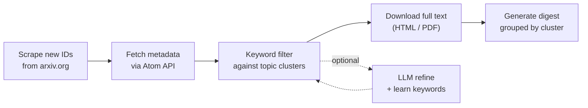

# arxiv-brew

Keyword-based arXiv paper filtering and digest generation. Designed to be called by LLM agents for automated daily literature monitoring.

## How it works



- **Pull** — scrape today's new paper IDs from configured arXiv categories, fetch metadata via Atom API
- **Filter** — match titles and abstracts against your keyword clusters (word-boundary and context-aware)
- **Download** — retrieve full text, HTML preferred, PDF fallback
- **Digest** — extract affiliations, format results grouped by topic cluster
- **LLM Refine** *(optional)* — an agent judges candidate relevance and suggests new keywords, which are persisted for future runs

## Install

```bash
git clone https://github.com/Surefire618/arxiv-brew.git
cd arxiv-brew
pip install .
```

For development:

```bash
pip install -e .
```

Python 3.10+, stdlib only. No external dependencies.

## Setup

```bash
# 1. Create your research profile
arxiv-brew init

# 2. Edit config/my_research.md with your arXiv categories and keywords
```

**Hint:** if you do not want to write `my_research.md` from scratch, you can ask your chatbot to generate it from the template.

Prompt example:

```text
I am setting up arxiv-brew for daily literature monitoring.
Please generate a complete `my_research.md` file in the exact format of `config/my_research.md.template`.

Use your best understanding of my research field to fill in:
- relevant arXiv categories
- 2-5 topic clusters
- word-boundary keywords
- broad keywords
- context keywords

Requirements:
- keep the same section structure as the template
- output only the final markdown file
- prefer precise technical keywords over vague topics
- include both core methods and target materials / systems when relevant
- do not invent personal details; infer only from my research area

My research area:
[describe your field here]
```

# 3. Build the keyword database
arxiv-keywords update
```

## Usage

```bash
# Daily digest (readable text)
arxiv-brew brew

# JSON output (for agents / scripts)
arxiv-brew brew --json

# Also save full JSON to file
arxiv-brew brew --output result.json
```

### Managing keywords (optional)

You can inspect and edit your keyword database at any time.

```bash
# Show current keywords grouped by cluster
arxiv-keywords list

# Add a keyword: arxiv-keywords add <cluster> <keyword>
arxiv-keywords add "ML Potentials" "graph neural network"

# Remove a keyword: arxiv-keywords remove <cluster> <keyword>
arxiv-keywords remove "ML Potentials" "graph neural network"

# After editing config/my_research.md, sync changes (preserves LLM-learned keywords)
arxiv-keywords update

# Full reset from profile (discards LLM-learned keywords)
arxiv-keywords reset
```

### Step-by-step pipeline (optional)

The commands below run individually what `arxiv-brew brew` does in one step.

```bash
arxiv-pull -o papers.json
arxiv-download papers.json -o downloaded.json
arxiv-summarize downloaded.json --digest-dir digests/
```

### Archive management

```bash
arxiv-db status
arxiv-db cleanup --retention-days 14
arxiv-db cleanup --force              # skip confirmation, useful in cron jobs
```

## Configuration

All keywords and categories come from your research profile (`config/my_research.md`). See [`config/my_research.md.template`](config/my_research.md.template) for the format.

The profile defines:
- **Categories** — which arXiv categories to scan (e.g. `cs.CL`, `cond-mat.mtrl-sci`). Full list: https://arxiv.org/category_taxonomy
- **Topic clusters** — groups of keywords (e.g. "NLP", "Reinforcement Learning")
- **Word boundary keywords** — short acronyms matched as whole words only
- **Broad keywords** — generic terms that require a context keyword to co-occur
- **Context keywords** — terms that validate broad keyword matches

## Agent integration

See [docs/agent_integration.md](docs/agent_integration.md) for how to use arxiv-brew with LLM agents (Claude Code, Codex, OpenClaw, etc.).

## CLI reference

| Command | Description |
|---|---|
| `arxiv-brew brew` | Run pipeline, print today's digest |
| `arxiv-brew brew --json` | Same, but JSON output |
| `arxiv-brew init` | Create research profile |
| `arxiv-brew refine` | Apply LLM refinement to candidates |
| `arxiv-keywords list` | Show all keywords |
| `arxiv-keywords add CLUSTER KW` | Add a keyword |
| `arxiv-keywords remove CLUSTER KW` | Remove a keyword |
| `arxiv-keywords update` | Sync from research profile |
| `arxiv-keywords reset` | Rebuild from profile |
| `arxiv-pull` | Pull and filter papers |
| `arxiv-download` | Download full text |
| `arxiv-summarize` | Generate digest |
| `arxiv-db` | Archive management |

All commands support `--help`.

## License

MIT
