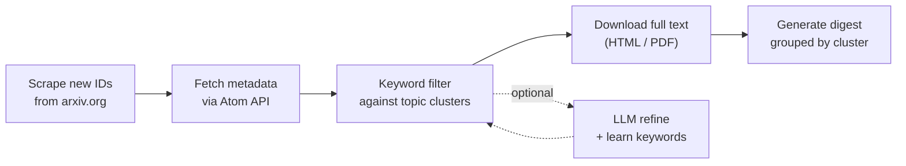

# arxiv-brew

Keyword-based arXiv paper filtering and digest generation. Designed to be called by LLM agents for automated daily literature monitoring.

## How it works



- **Pull** — scrape today's new paper IDs from configured arXiv categories, fetch metadata via Atom API
- **Filter** — match titles and abstracts against your keyword clusters (word-boundary and context-aware)
- **Download** — retrieve full text, HTML preferred, PDF fallback
- **Digest** — extract affiliations, format results grouped by topic cluster
- **LLM Refine** *(optional)* — an agent judges candidate relevance and suggests new keywords, which are persisted for future runs

## Install

```bash
pip install .
```

Or install in development mode:

```bash
pip install -e .
```

Python 3.10+, stdlib only. No external dependencies.

## Quick start

```bash
# 1. Set up your research profile
arxiv-brew init
# Edit config/my_research.md with your topics and keywords

# 2. Initialize keywords and run
arxiv-brew --research-profile config/my_research.md --init-keywords --digest-only
```

## Usage

```bash
# Daily digest to stdout
arxiv-brew --digest-only

# Full pipeline with file output
arxiv-brew --output result.json --paper-dir papers --digest-dir digests

# Step-by-step
arxiv-pull -o papers.json
arxiv-download papers.json -o downloaded.json
arxiv-summarize downloaded.json --digest-dir digests/

# Archive management
arxiv-db status
arxiv-db cleanup --retention-days 14
```

## Configuration

All keywords and categories come from your research profile (`config/my_research.md`). See [`config/my_research.md.template`](config/my_research.md.template) for the format.

The profile defines:
- **Categories** — which arXiv categories to scan (e.g. `cs.CL`, `cond-mat.mtrl-sci`). Full list: https://arxiv.org/category_taxonomy
- **Topic clusters** — groups of keywords (e.g. "NLP", "Reinforcement Learning")
- **Word boundary keywords** — short acronyms matched as whole words only
- **Broad keywords** — generic terms that require a context keyword to co-occur
- **Context keywords** — terms that validate broad keyword matches

Run `arxiv-brew --init-keywords --research-profile config/my_research.md` after editing your profile to rebuild the keyword database.

## Agent integration

See [docs/agent_integration.md](docs/agent_integration.md) for how to use arxiv-brew with LLM agents (Claude Code, Codex, OpenClaw, etc.).

## CLI reference

Installed via `pip install .`:

| Command | Description |
|---|---|
| `arxiv-brew` | Full pipeline |
| `arxiv-brew init` | Set up config/my_research.md |
| `arxiv-pull` | Pull and filter today's papers |
| `arxiv-download` | Download full text |
| `arxiv-summarize` | Generate digest |
| `arxiv-db` | Archive management (status, cleanup) |

All commands support `--help`.

## License

MIT
