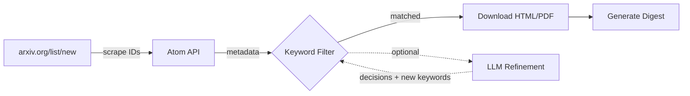

# arxiv-brew

Keyword-based arXiv paper filtering and digest generation. Designed to be called by LLM agents for automated daily literature monitoring.

## How it works



1. **Pull** — scrapes today's new submissions from configured arXiv categories, fetches metadata via Atom API
2. **Filter** — matches paper titles and abstracts against your keyword database. Supports word-boundary matching for acronyms and context-aware broad keywords
3. **Download** — fetches full text (HTML preferred, PDF fallback)
4. **Summarize** — extracts affiliations, formats digest grouped by topic cluster
5. **(Optional) LLM Refinement** — an agent can judge candidates and suggest new keywords, which are persisted for future matching

## Install

```bash
git clone https://github.com/Surefire618/arxiv-brew.git
cd arxiv-brew
```

Python 3.10+, stdlib only. No external dependencies.

## Quick start

```bash
# 1. Create your research profile
python -m arxiv_brew.init
# Edit config/my_research.md with your topics and keywords

# 2. Initialize keywords and run
python -m arxiv_brew --research-profile config/my_research.md --init-keywords --digest-only
```

## Usage

```bash
# Daily digest to stdout
python -m arxiv_brew --digest-only

# Full pipeline with file output
python -m arxiv_brew --output result.json --paper-dir papers --digest-dir digests

# Step-by-step
python -m arxiv_brew.pull -o papers.json
python -m arxiv_brew.download papers.json -o downloaded.json
python -m arxiv_brew.summarize downloaded.json --digest-dir digests/

# Archive management
python -m arxiv_brew.db status
python -m arxiv_brew.db cleanup --retention-days 14

# Show keyword stats
python -m arxiv_brew.keywords
```

## Configuration

All keywords and categories come from your research profile (`config/my_research.md`). See [`config/my_research.md.template`](config/my_research.md.template) for the format.

The profile defines:
- **Categories** — which arXiv categories to scan (e.g. `cs.CL`, `cond-mat.mtrl-sci`)
- **Topic clusters** — groups of keywords (e.g. "NLP", "Reinforcement Learning")
- **Word boundary keywords** — short acronyms matched as whole words only
- **Broad keywords** — generic terms that require a context keyword to co-occur
- **Context keywords** — terms that validate broad keyword matches

Run `python -m arxiv_brew --init-keywords --research-profile config/my_research.md` after editing your profile to rebuild the keyword database.

## Agent integration

See [docs/agent_integration.md](docs/agent_integration.md) for how to use arxiv-brew with LLM agents (Claude Code, Codex, OpenClaw, etc.).

## Bash wrapper (optional)

A convenience script `arxiv-brew` wraps the Python commands:

```bash
chmod +x arxiv-brew
arxiv-brew init
arxiv-brew run --digest-only
arxiv-brew db status
```

## License

MIT
